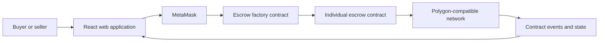

# EsKro

### A decentralized escrow protocol for trust-minimized payments

EsKro is the software prototype developed as part of a bachelor's thesis on the use of blockchain and smart contracts for digital escrow. The application explores how two parties can coordinate a payment without relying on a traditional escrow intermediary.

The prototype provides a browser-based interface for creating and managing bilateral escrow agreements. Wallet authentication and transaction signing are handled through MetaMask, while the agreement state and deposited funds are managed by Ethereum-compatible smart contracts.

> **Academic prototype:** EsKro was built for research and demonstration purposes. It has not been audited and must not be used to secure real funds.

## Thesis motivation

Conventional online transactions often require a trusted third party to hold funds, verify completion, and resolve uncertainty between a buyer and a seller. This introduces fees, operational overhead, and a central point of trust.

EsKro investigates whether a smart contract can replace part of this intermediary role by:

- recording the agreement and its participants on-chain;
- enforcing collateral requirements through program logic;
- making state transitions transparent and independently verifiable;
- releasing or returning funds according to predefined conditions; and
- allowing both parties to interact using their own blockchain wallets.

The project is an implementation artifact for evaluating the feasibility and user interaction of a decentralized escrow workflow. It is not presented as a complete replacement for legal arbitration or consumer-protection mechanisms.

## How the protocol works

1. A user connects a MetaMask wallet.
2. An escrow agreement is created with a buyer address, seller address, and sale price.
3. The seller deposits a stake equal to the sale price.
4. The buyer deposits twice the sale price, covering the payment and buyer collateral.
5. Once both deposits are present, the agreement becomes active.
6. The buyer can confirm successful completion, or either party can signal cancellation according to the smart contract rules.
7. The interface listens for contract events and updates the displayed agreement state.

The user interface represents agreements as `Unlocked`, `Active`, `Cancelled`, or `Completed`, based on the state returned by the escrow contract.

## System overview



The repository contains the web client and the compiled contract ABIs used by that client. The Solidity source and deployment scripts are not included in this repository.

## Main features

- MetaMask wallet connection
- Automatic wallet network switching
- Creation of buyer/seller escrow agreements
- Discovery of agreements associated with the connected account
- Buyer and seller staking
- Stake withdrawal before both parties have locked their deposits
- Cancellation and cancellation revocation
- Buyer confirmation of a completed transaction
- Live interface updates from smart-contract events
- Direct links to agreements in a block explorer

## Technology stack

| Layer | Technology |
| --- | --- |
| User interface | React 17, HTML, CSS |
| Blockchain integration | ethers.js 5 |
| Wallet | MetaMask |
| Smart contracts | Ethereum-compatible contract ABIs |
| Configured network | Polygon Mumbai test network |
| Build tooling | Create React App / react-scripts 4 |

## Repository structure

```text
public/                     Static web assets
src/
├── components/             Wallet, agreement, and interface components
├── contracts/              Contract ABIs and deployed factory address
├── data/networks.js        Wallet network configuration
├── App.js                  Main application composition
└── index.js                React entry point
package.json                Dependencies and development commands
```

## Running the prototype locally

### Prerequisites

- Node.js and npm
- A browser with the MetaMask extension
- Test-network funds for transaction fees and escrow deposits

This project uses an older Create React App toolchain. Node.js 16 is the safest option for reproducing the original environment. The start command includes the legacy OpenSSL compatibility flag required by some newer Node.js releases.

### Installation

```bash
git clone https://github.com/11Charan/BachelorThesis.git
cd BachelorThesis
npm install
npm start
```

The development server normally opens at [http://localhost:3000](http://localhost:3000).

You may use Yarn instead:

```bash
yarn install
yarn start
```

Use one package manager consistently to avoid unnecessary differences between `package-lock.json` and `yarn.lock`.

## Network and contract configuration

The checked-in prototype is configured for the legacy Polygon Mumbai test network and references an existing factory contract address. To run the system on another Ethereum-compatible network:

1. deploy compatible factory and escrow contracts;
2. update the network definition in `src/data/networks.js`;
3. update `factoryAddress` in `src/contracts/contractData.js`; and
4. replace the ABI files in `src/contracts/` if the contract interfaces changed.

Because test networks and public RPC endpoints change over time, the original deployment may no longer be reachable. A new deployment may therefore be necessary when reproducing the thesis prototype.

## Available commands

```bash
npm start       # Run the development server
npm test        # Start the test runner
npm run build   # Create an optimized production build
```

## Scope and limitations

- The repository contains the client application and compiled ABIs, but not the Solidity source code.
- The smart contracts have not been presented as independently audited.
- The interface depends on MetaMask and an injected EIP-1193 provider.
- The prototype does not include identity verification, off-chain evidence, dispute arbitration, or fiat settlement.
- Agreement details and wallet addresses are public on the configured blockchain.
- Transaction confirmation time and cost depend on the selected network.
- Client-side validation is intentionally limited and should not be treated as a security boundary.

These constraints are important when interpreting the prototype and any conclusions drawn from it in an academic context.

## Research reproducibility

For a reproducible evaluation, record the following alongside experimental results:

- Git commit hash used for the evaluation;
- Node.js and package-manager versions;
- browser and MetaMask versions;
- blockchain network and chain ID;
- deployed factory and escrow contract addresses; and
- transaction hashes for the tested protocol flows.

## Citation

If you reference this software in academic work, cite the accompanying bachelor's thesis and include the repository URL and the exact Git commit used:

```text
EsKro: A Decentralized Escrow Protocol for Trust-Minimized Payments.
Bachelor's thesis software artifact.
https://github.com/11Charan/BachelorThesis
```

Add the thesis author, institution, department, year, and thesis title to match your university's required citation style.

## License

No open-source license has been added to this repository. Unless a license is added, the source remains subject to standard copyright restrictions.
